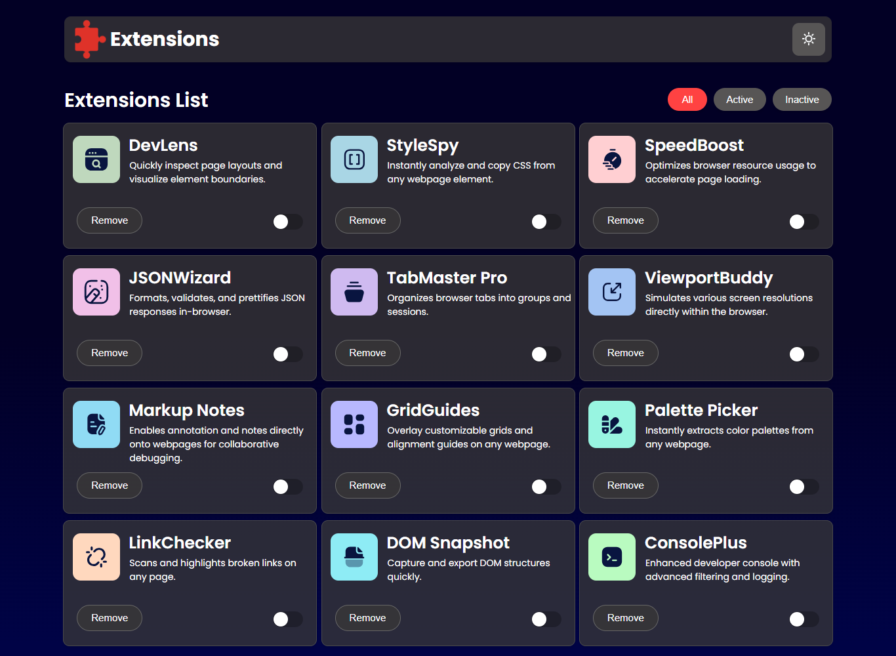

# 🧩 Browser Extension Manager UI

A modern and intuitive user interface for managing browser extensions with ease. Built for speed, simplicity, and clarity, this UI replicates core functionality found in native browser extension managers — but with a clean and customizable front-end experience.

---

## 🚀 Features

- 🔍 **Search & Filter** – Quickly find extensions by name or status.
- 📦 **Enable/Disable** – Toggle extensions with a single click.
- 🧼 **Minimal UI** – Clean, responsive design with no clutter.
- ⚙️ **Expandable Interface** – Designed to be integrated with extension APIs.
- 💡 **Lightweight Codebase** – Fast loading, no heavy dependencies.

---

## 🛠️ Tech Stack

- **HTML5**
- **CSS3** (Flexbox/Grid)
- **Vanilla JavaScript (ES6+)**
- **Responsive Design Principles**

---

## 📸 Screenshots



---

## 🧪 Getting Started

To run the project locally:

```bash
# 1. Clone the repository
git clone https://github.com/AyaanFarrukh/Browser-Extension-Manager-UI.git

# 2. Navigate into the project folder
cd Browser-Extension-Manager-UI

# 3. Open index.html in your browser
